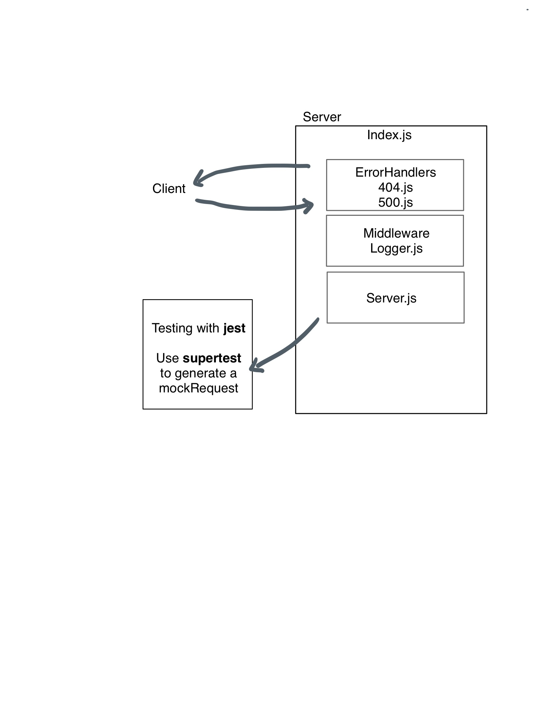

# LAB - Class 01

## Project: Server Deployent Practice

### Author: Brenda 

### Problem Domain  

Basic API Server where we write some middleware and practice deployment

### Links and Resources

- [GitHub Actions ci/cd](https://github.com/brenda70904/server-deployment-practice/actions)
- [back-end server url](http://xyz.com) (when applicable)
- [front-end application](http://xyz.com) (when applicable)

### Setup

#### `.env` requirements (where applicable)

not reqire for this lab, wait for tomorrow

#### How to initialize/run your application (where applicable)

- e.g. `npm start`

#### How to use your library (where applicable)

#### Features / Routes

- Feature One: Deploy Dev

#### Tests

- How do you run tests?
to run the test, use `npm test`
- Any tests of note?
N/A
- Describe any tests that you did not complete, skipped, etc
Completed.

#### UML

